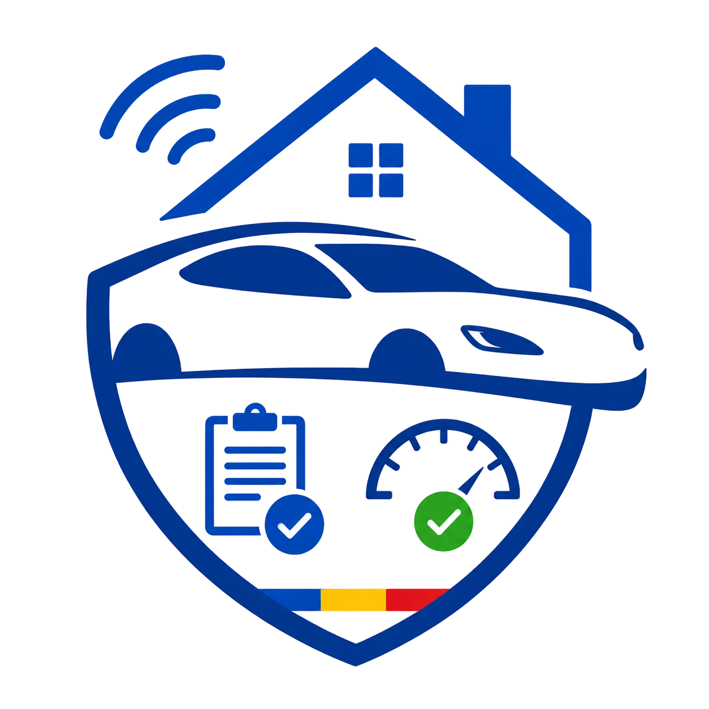
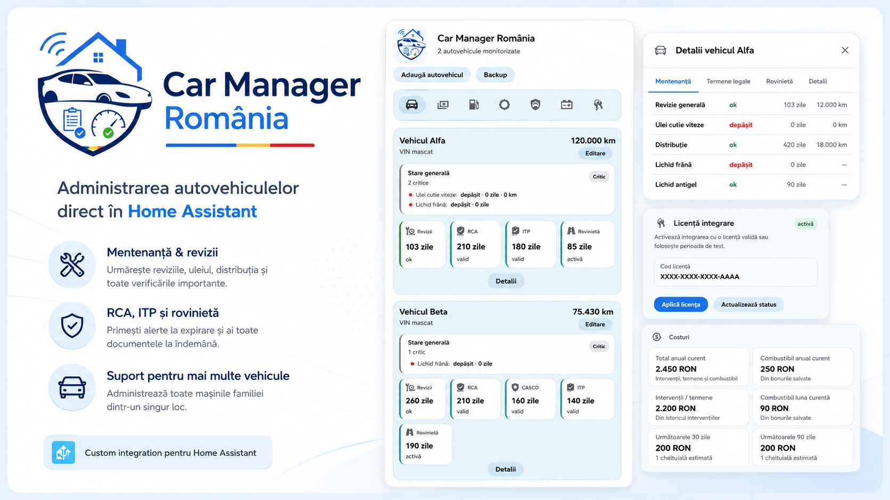
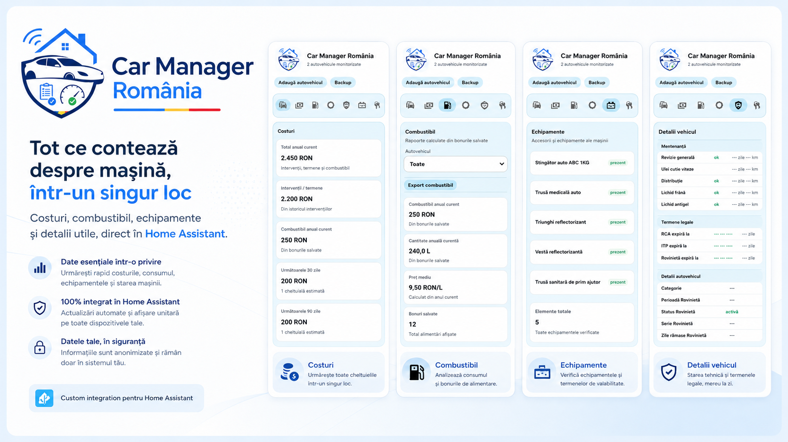

<p align="center">
  
</p>

<h1 align="center">Car Manager România</h1>

<p align="center">
  Integrare custom pentru Home Assistant dedicată administrării unuia sau mai multor autovehicule.
</p>

<p align="center">
  
  
  
</p>

---

<p align="center">
  
</p>

## Despre proiect

**Car Manager România** este o integrare custom pentru Home Assistant, creată pentru administrarea autovehiculelor direct din dashboard.

Integrarea urmărește într-un singur loc informațiile importante despre mașină: revizii, intervale de service, rovinietă, RCA, ITP, costuri, combustibil, echipamente auto și alte date utile pentru întreținere.

Scopul este simplu: să ai o imagine clară asupra fiecărui autovehicul și să vezi rapid ce este în regulă, ce se apropie de expirare și ce necesită atenție.

---

## Ce poate face integrarea

Car Manager România adaugă în Home Assistant un sistem dedicat pentru evidența autovehiculelor.

Pentru fiecare vehicul poți gestiona:

- date generale despre autovehicul;
- kilometraj actual;
- revizie generală;
- ulei motor și filtre;
- distribuție;
- ulei cutie viteze;
- lichid frână;
- lichid antigel;
- rovinietă;
- RCA;
- ITP;
- costuri și intervenții;
- bonuri de combustibil;
- echipamente auto obligatorii sau utile;
- statusuri automate în funcție de termen și kilometri;
- afișare centralizată într-un card Lovelace dedicat.

Integrarea este construită modular, astfel încât funcționalitățile să poată fi extinse treptat fără refacerea întregii structuri.

---

## Card Lovelace dedicat

Integrarea include un card Lovelace propriu, conceput special pentru afișarea rapidă a stării fiecărui vehicul.

Cardul afișează:

- vehiculele configurate;
- kilometrajul curent;
- statusul general;
- alertele critice;
- zile rămase până la expirarea RCA;
- zile rămase până la expirarea ITP;
- zile rămase pentru rovinietă;
- zile și kilometri rămași până la revizie;
- detalii extinse pentru fiecare vehicul;
- costuri;
- combustibil;
- echipamente;
- informații despre licență.

Cardul este gândit pentru utilizare atât pe desktop, cât și pe mobil.

---

## Suport pentru mai multe vehicule

Car Manager România poate gestiona mai multe autovehicule în aceeași integrare.

Fiecare vehicul are propriile date, propriile termene, propriile entități și propriile statusuri. Astfel, poți administra mașina personală, mașina familiei sau o flotă mică, fără să amesteci informațiile între ele.

Integrarea păstrează local datele fiecărui vehicul și permite afișarea separată în card.

---

## Mentenanță și revizii

Integrarea calculează automat statusul pentru principalele elemente de mentenanță.

Sunt urmărite, printre altele:

- revizie generală / ulei motor + filtre;
- ulei cutie viteze;
- distribuție;
- lichid frână;
- lichid antigel.

Pentru fiecare element se pot utiliza:

- kilometrajul la ultima intervenție;
- data ultimei intervenții;
- intervalul în kilometri;
- intervalul în zile.

Pe baza acestor date, integrarea poate afișa automat:

- kilometri rămași;
- zile rămase;
- status: ok, atenție, critic sau depășit.

---

## Rovinietă, RCA și ITP

Integrarea urmărește separat termenele legale importante pentru fiecare vehicul:

- rovinietă;
- RCA;
- ITP.

Acestea sunt tratate separat față de mentenanța mecanică, deoarece reprezintă obligații legale, nu intervenții tehnice asupra mașinii.

Cardul afișează clar câte zile mai sunt până la expirare și marchează vizual situațiile care necesită atenție.

---

<p align="center">
  
</p>

## Costuri, combustibil și echipamente

Pe lângă revizii și termene, integrarea include module pentru evidența costurilor și a dotărilor auto.

### Costuri

Modulul de costuri permite o imagine de ansamblu asupra cheltuielilor asociate autovehiculului:

- total anual;
- intervenții și termene;
- costuri estimate pentru următoarele perioade;
- evidență pe vehicul.

### Combustibil

Modulul de combustibil permite salvarea și urmărirea alimentărilor.

Pot fi afișate:

- combustibilul anual;
- combustibilul lunar;
- cantitatea alimentată;
- prețul mediu;
- ultimul bon salvat;
- numărul de alimentări.

### Echipamente

Modulul de echipamente ajută la verificarea dotărilor obligatorii sau utile din mașină:

- stingător;
- trusă medicală;
- triunghiuri reflectorizante;
- vestă reflectorizantă;
- alte echipamente configurabile.

Pentru fiecare echipament pot fi urmărite informații precum prezența, termenul de valabilitate, poziția în mașină și costul.

---

## Sistem de licențiere

Car Manager România include un sistem de licențiere integrat.

După instalare, integrarea poate fi folosită într-o perioadă de test de **90 de zile**, fără introducerea unei licențe.

Perioada de test permite verificarea funcționalităților principale ale integrării înainte de activarea unei licențe permanente.

După expirarea perioadei de test, pentru continuarea utilizării este necesară activarea unei licențe valide.

Licența poate fi introdusă și verificată direct din cardul Lovelace, folosind secțiunea dedicată de licențiere.

Statusul licenței poate fi actualizat din card prin butonul **Actualizează status**.

Verificarea se face prin serviciul backend al integrării:


```text
car_manager_romania.refresh_license_status
